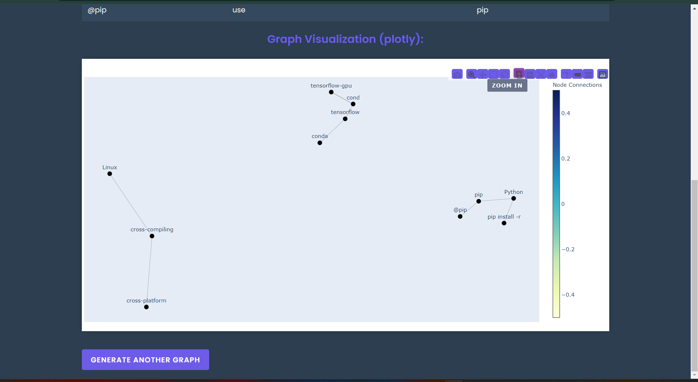

# Text-Based Knowledge Graph Visualization App

This Flask application generates and visualizes text-based knowledge graphs using various Python libraries. It employs REBEL (Relation Extraction By End-to-end Language generation) for triplet extraction from text, and then uses NetworkX, Plotly, and Graphviz for graph generation and visualization. Some visualisation techniques may not render due to Flask and its limitations, please refer to the jupyter notebook in the directory `modular_textKG.ipynb` in that case.

## Overview

The application processes text input to extract knowledge in the form of triplets (subject-predicate-object) using the REBEL model. These triplets are then used to construct and visualize knowledge graphs, providing insights into the relationships within the text.

## Prerequisites

Before running the application, ensure you have the following installed:

1. Python 3.7 or higher
2. pip (Python package installer)
3. Graphviz

## Installation

1. Fork this repository on GitHub and clone your fork to your local machine:

   ```
   git clone https://github.com/your-username/your-repo-name.git
   cd your-repo-name
   ```

2. Create and activate a virtual environment:

   - For Windows:
     ```
     python -m venv venv
     venv\Scripts\activate
     ```
   - For macOS/Linux:
     ```
     python3 -m venv venv
     source venv/bin/activate
     ```

3. Install the required Python packages:

   ```
   pip install flask transformers torch pandas networkx matplotlib plotly graphviz
   ```

4. Install Graphviz on your local system and add it to your system path:
   - For Windows: Download and install from [Graphviz Official Website](https://graphviz.org/download/)
   - For macOS: Use Homebrew: `brew install graphviz`
   - For Linux: Use your distribution's package manager, e.g., `sudo apt-get install graphviz` for Ubuntu

## Running the Application

1. Ensure you're in the project directory and your virtual environment is activated.

2. Set the Flask app environment variable:

   - For Windows:
     ```
     set FLASK_APP=app.py
     ```
   - For macOS/Linux:
     ```
     export FLASK_APP=app.py
     ```

3. Run the Flask application:

   ```
   flask run
   ```

4. Open your web browser and go to `http://127.0.0.1:5000/` to access the application.

## Usage

1. Enter or paste the text you want to analyze in the input form on the homepage.
2. Click "Generate Knowledge Graph" to process the text and create visualizations.
3. View the generated knowledge graph visualizations on the result page.

## How It Works

1. **Text Input**: The application takes text input from the user.
2. **Triplet Extraction**: REBEL model is used to extract subject-predicate-object triplets from the input text.
3. **Graph Construction**: The extracted triplets are used to construct a knowledge graph using NetworkX.
4. **Visualization**: The graph is visualized using multiple methods:
   - NetworkX with Matplotlib for a static graph visualization
   - Plotly for an interactive graph visualization
   - Graphviz for a hierarchical graph layout

## Example Results

Here are some examples of the visualizations you can expect from this application:

### User Interface


### Triplet Extraction


### Interactive Graph Visualization


_Description: This image demonstrates an interactive knowledge graph created with Plotly, allowing for dynamic exploration of the text's structure._

## Note

Ensure Graphviz is properly installed and accessible from your system's PATH. The application uses Graphviz in addition to other libraries for graph generation and visualization.

## Troubleshooting

If you encounter any issues with package installations or running the application, please check the following:

1. Ensure your Python version is compatible (3.7+).
2. Make sure your virtual environment is activated when installing packages and running the app.
3. If you face issues with PyTorch or Transformers installation, visit their official websites for specific installation instructions for your system.
4. For Graphviz-related issues, confirm that it's correctly installed and added to your system's PATH.
5. If you encounter memory issues when processing large texts, try reducing the input size or running the application on a machine with more RAM.
